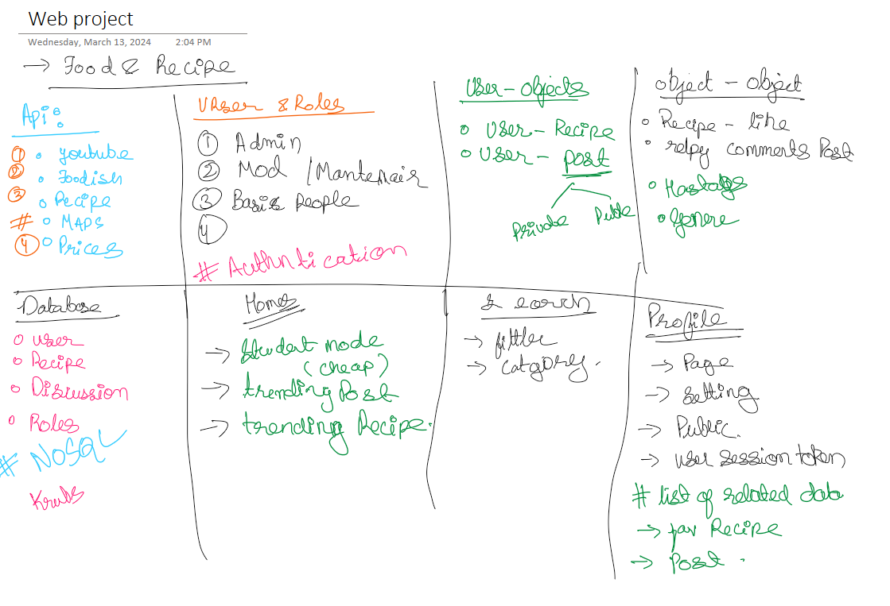
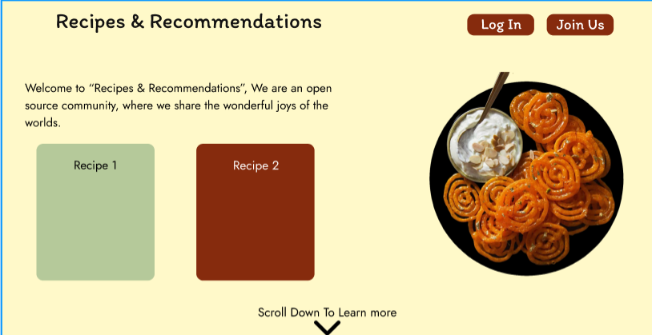

# Web Dev CS5610 : Project
## Tittle: Food Recipe Web Site / Social Media 

This project involves developing a website focused on culinary exploration, incorporating features such as recipe search functionalities augmented with cruise-based recommendations (e.g., prioritizing recipes akin to a culinary adventure or hidden gem). Additionally, the platform facilitates user interaction through group formation, recipe sharing, and social engagement.

Furthermore, the website aims to integrate restaurant recommendations tailored to specific cruise experiences. Additionally, it will include a student mode feature, offering suggestions for budget-friendly yet satisfying dining options, including quick and convenient meals suitable for busy schedules.

### Developers:
 - [Ankit Sinha](https://github.com/Ank-22)  
 - [Eric Nguyen](https://github.com/enguyen11)
 - [Suraj Mishra ☀️](https://github.com/sm5689)
 - [Parwaz Singh :smile:](https://github.com/Parwazsingh) 

 ## Ideation/planning:
 ### Color palette: 
 - https://colorhunt.co/palette/b5c99a862b0dfff9c9ffc95f (Picked this because when ever I think food, I think of nature/earth and this color kinda suites that) 
   

### Overview Of UI
We will try to implement a UI in a form of book style animation and scroll. Where the recipes are listed and font use will be hand written ones. 

 - The main recipes will have listed the recipe and then clicking on a comment button a piece of paper should come up will all the interaction. 

#### Landing Page Design  (Basic Idea):

 #### Fonts (In consideration):
 -  https://fonts.google.com/specimen/Pangolin?classification=Handwriting
 - https://fonts.google.com/specimen/Patrick+Hand?classification=Handwriting
  - https://fonts.google.com/specimen/Edu+NSW+ACT+Foundation?classification=Handwriting

### Objective for 7th April, 2024:
#### Primary:
- Start coding for UI
- Setup MongoDB Database
- Learn Parallax 
#### Secondary:
- Play With API
